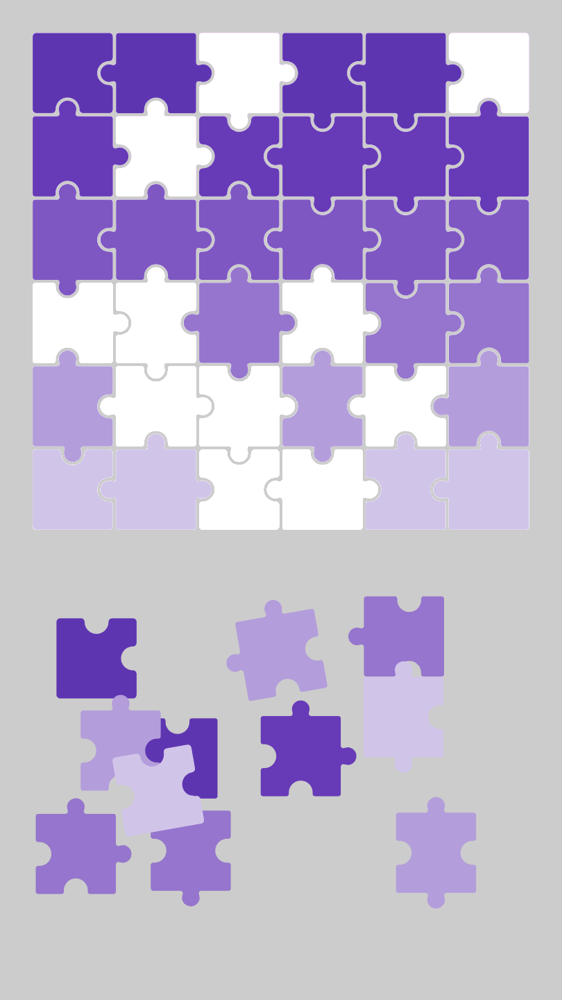
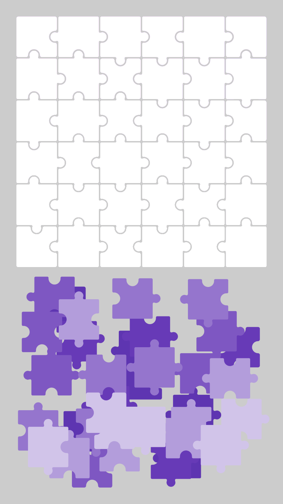

[EN](./README.md)

# 🧩 Drag-and-Drop

### [Live Demo](https://semivate.github.io/drag-and-drop-game/)

Інтерактивна гра-пазл, розроблена на базі HTML5 Canvas у середовищі Adobe Animate за допомогою JavaScript та веб-двигуна CreateJS.

Суть геймплею полягає в тому, що гравець має взяти деталь та правильно розвернути її і встановити на відповідне місце у верхній зоні для складення пазла. Гра має повністю автономний нескінченний цикл — після успішного збирання, або оновлення сторінки, деталі автоматично перемішуються для нового раунду.

---

## Функції (Що вже зроблено)

- Самостійне сканування сцени при старті та знаходження всіх наявних об'єктів в ній.
- Гравець може вільно перекладати, сортувати та залишати деталі в будь-якому місці всередині робочої зони.
- При наближенні до цілі деталь автоматично притягується, фіксується і стає неактивною.
- Для ПК-гравців реалізовано обертання активної деталі за допомогою стрілок або клавіш A/D.
- Рандомайзер видає деталям випадковий початкове розміщення, кут.
- Ігровий процес озвучено трьома ефектами звуку.
- Коли всі деталі зібрано, гра автоматично запускає новий раунд.

---

## Проблеми / Виклики

- Мобільна адаптація керування
- Знадобиться адаптувати гру під екрани з іншим співвідношенням сторін
- Грі бракує UI-дизайну:
- Створення бази даних (масиву), який після кожного раунду завантажуватиме нові набори об'єктів для створення level-гри.
- Конфлікт шарів (zIndex), звичайні методи підняття об'єктів наперед викликають збої координат.

---

## Навчився

1.  Розумінню того, чому в розробці категорично не можна використовувати кирилицю в коді.
2.  Роботи з життєвим циклом подій (Event Listeners) миші та клавіатури, що захищає гру від зависань.
3.  Різниці між глобальними координатами сцени та локальними координатами шарів/контейнерів в Adobe Animate.
4.  Опанував як компенсувати похибки координат при ресайзі Canvas, використовуючи абсолютний вектор миші замість динамічних позицій об'єкта.
5.  Адаптації інтерфейсу під вертикальні екрани смартфона та роботі з WebAudio API без перевантаження оперативної пам'яті.

---

## Використані технології

- Adobe Animate (HTML5 Canvas API)
- JavaScript (Vanilla JS)
- CreateJS (EaselJS та SoundJS)
- Adobe Illustrator

---

## Попередній перегляд

